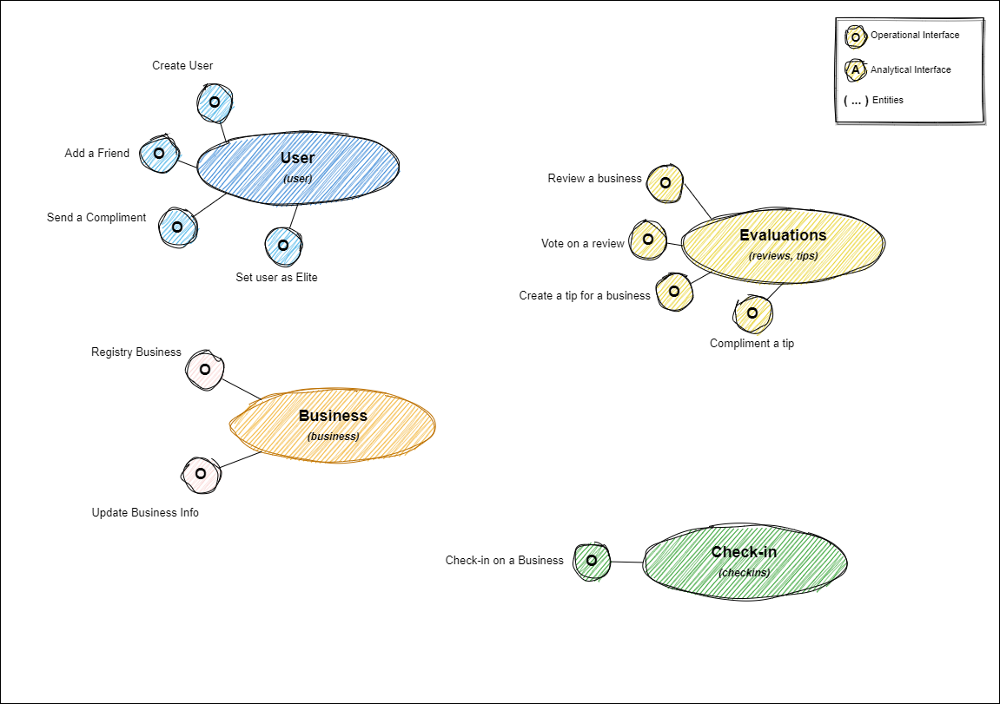

# Data Mesh Project

[](https://opensource.org/licenses/)

<!-- NEXT: Find a good size for this image on Github -->


This project aims to design and implement a data mesh architecture by using close to real business data
provided on the [Yelp Dataset](https://www.yelp.com/dataset). This matches perfectly with the Data Mesh
concept of modeling analytics for business. For details about the data see
[Yelp Dataset Documentation](https://www.yelp.com/dataset/documentation/main).

Note that this is not a production-ready project. This is rather a lab to deep my knowledge into Data
Engineering, DevOps and mainly data meshs. So errors and changes will occur as my knowledge evolves. Feel free
to contribute with this project by contacting me with suggestions, tips and ways that I can improve this code
(see [Contributing](#contributing) for more details)

1. [Logical Architecture](#logical-architecture)
1. [Platform Architecture](#platform-architecture)
1. [Setup your Local Environment](#setup-your-local-environment)
1. [Contributing](#contributing)
1. [References](#references)

## Logical Architecture

> **Note** </br>
> Please refer to [Logical Architecture](docs/logical-architecture.md) for details about the diagram.

<p align="center">

</p>

## Platform Architecture

<p align="center">

</p>

## Setup your local environment

<!-- NEXT: Find a good size for this image on Github -->


In order to deploy the resources a kubernetes cluster is required. How to deploy a local kubernetes cluster
is out of the scope of this project. This code was tested under a [MicroK8S](https://microk8s.io/) managed
cluster. If this is your choice the following addons were enabled:

```shell
microk8s enable dns
microk8s enable helm
microk8s enable helm3
microk8s enable hostpath-storage
microk8s enable metrics-server
```

> **Note** </br>
> There are many solutions out there to deploy a local cluster (e.g. Minikube, Kind). You can see some
> examples on [Kubernetes: Install Tools](https://kubernetes.io/docs/tasks/tools/).

## Setup your development environment

This project embed a full-feature developer container for VSCode users containing all the tools, extensions
and required configurations to develop the code. If you don't know how dev containers work please read
[Visual Studio Code: Developing Inside a Container](https://code.visualstudio.com/docs/devcontainers/containers).

For people that do not use VSCode the [Dockerfile](.devcontainer/Dockerfile) contains all the tools used by
the project. You can use that as a base for setup your environment.

## Contributing

Since this is a lab project currently I am the only person developing the code. However feel free to propose
new features/improvements, ask questions, suggest tips and etc on the  **discussion** tab. For bug reports
use the **issues** tab (with the bug template).

> **Note** </br>
> Please, read the [CONTRIBUTING Guide](CONTRIBUTING.md) for more details about styleguides, best practices
> and conventions followed by the project.

## References

Below are some main references used by this project. Feel free to read them for a more deep understanding
about the project.

* [Data Mesh Architecture](https://www.datamesh-architecture.com/)
* [Data Mesh Architecture (Tech Stack): dbt and Snowflake](https://www.datamesh-architecture.com/tech-stacks/dbt-snowflake)
* [Data Mesh Architecture (Tech Stack): MinIO and Trino](https://www.datamesh-architecture.com/tech-stacks/minio-trino)
* [Data Mesh Principles and Logical Architecture](https://martinfowler.com/articles/data-mesh-principles.html)
* [MicroK8S](https://microk8s.io/)
* [Yelp Dataset](https://www.yelp.com/dataset)
