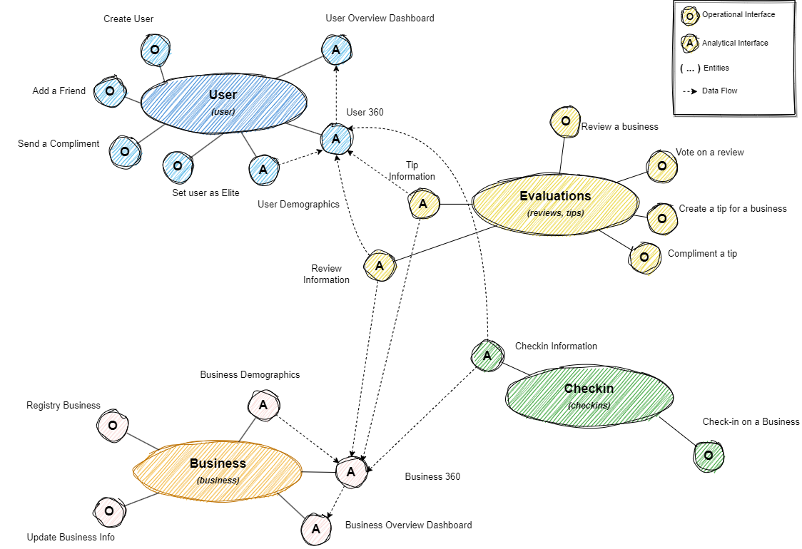
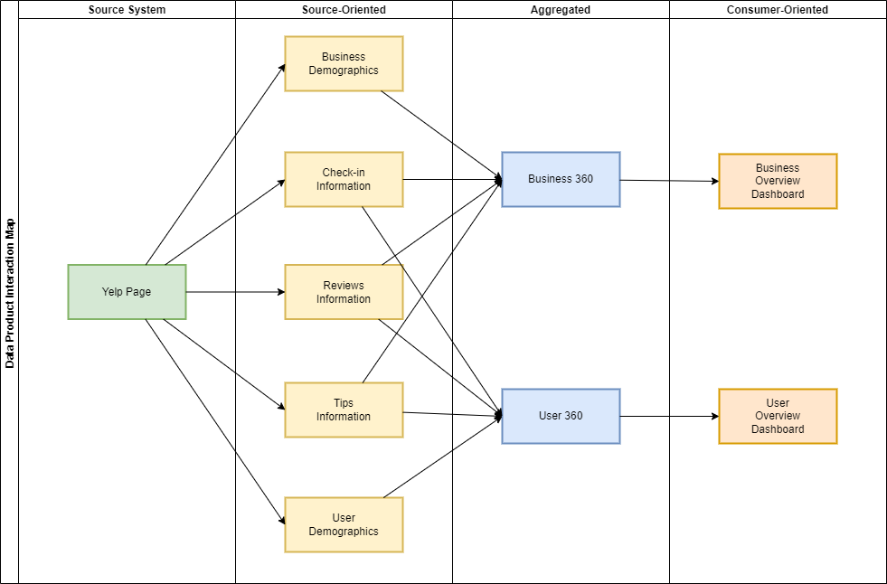

# Logical Architecture

This document aims to explain more deeply the logical architecture of this project. By logical architecture
understand:

> [...] An architecture that arranges the analytical data by domains. In this architecture, the domain’s
> interface to the rest of the organization not only includes the operational capabilities but also access
> to the analytical data that the domain serves.
> ― Zhamak Dehghani

1. [Logical-Diagram](#logical-diagram)
1. [Product Interaction Map](#product-interaction-map)
1. [Domains](#domains)
1. [Operational Interfaces](#operational-interfaces)
1. [Analytical Interfaces](#operational-interfaces)

## Logical Diagram

## Product Interaction Map

## Domains

* **User:** Domain responsible to manage information about the users and their interactions with another
users. This range from registration, friends, compliments and other user related capabilities.
* **Business:** Manage business information such as location, attributes, categories and related information.
Note that reviews, checkins and tips besides being very close to business they are in fact a relationship
between users and business, so they have their own domains to handle.
* **Evaluation:** Handle all types of evaluations from an user to a business (i.e. reviews and tips). This
is the only domain with multiple entities because of their similarities. According to Yelp, tips are
"a way to pass along some key information about a business [...] without writing a full review about your
experiences.". In fact, small reviews are converted automatically to tips in the platform.
* **Check-In:** Manage the user's check-ins on a business.

## Operational Interfaces

The operational interfaces described in the diagram are not an exhaustive list of capabilities for each
domain. They are rather a way of understand better which data each domain have control and to help develop the
products. Because of that some operational interfaces were omitted. For example, in a typical social network
besides the "Add a Friend" interface, others like "Accept Friend Request" and/or "Unfriend" are common. For a
simplified description and since the data will not reflect these kind of operations, these interfaces are not
presented.

## Analytical Interfaces (a.k.a Data Products)

This project creates some data products for each of these domains. For more information about the Analytical
interfaces described in the diagram. Refer to their own documentation on [products folder](../products/).
