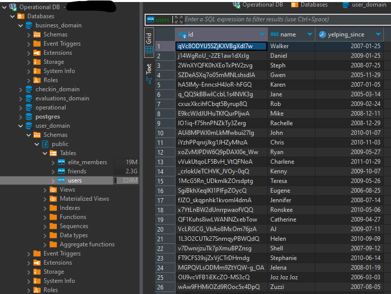

# Infrastructure

1. [Architecture](#architecture)
1. [Data Platform](#data-platform)
1. [Other Resources](#other-resources)
1. [FAQ](#faq)

## Architecture

## Data Platform

Below is the description of all the resources deployed for the central self-serve data platform as defined
in the data mesh architecture. This is, that are managed by an data-platform team and not by the domains.

### Monitoring Stack (Grafana, Loki and Prometheus)

To achieve a better observability all the resources of the platform are monitored via
Prometheus + Loki + Grafana Stack. The role of **Prometheus** is to centralize all the metrics generated for each
tool (and also cluster resources) if the metrics are available. The same idea is implemented by
**Grafana Loki** but instead of metrics it collects logs, this is useful for a more complete overview of
the state of the platform. Finally, all these metrics and logs can be visualized on **Grafana** for people
to be able to take action. Is also on Grafana that alerts are managed based on the received information.

  
  

### Object Storage (MinIO)

To store all the data used in the project a **MinIO tenant** is deployed. This data will further be used with
**Trino** to make queries and **dbt** to transform the data and create other products. Besides storing
operational/analytical data. MinIO is also used by other applications to store their required information.
For example, the tenant is used by **Grafana Loki** to store logs.

> **Note**  
> See [MinIO Tenant Values](storage/minio/values-tenant.yaml) on `tenant.bucket` configuration for more
> information about each bucket such as lifecycles, versioning and other configurations.

<!-- TODO: Add 2 screenshots (Bucket and inside some bucket) a screenshot when some data is already added  -->

#### Data Buckets and Medallion Architecture

Analytical data (including data coming from operational database) are all be stored using a
**[medallion (or multi-hop) architecture](https://www.databricks.com/glossary/medallion-architecture)**.
There are 3 layers of data each one defined by it's own bucket.

* **Bronze Layer:** Stores the raw data coming from different sources. For this lab, this means the
operational data ingested for analytics (and any other raw data) will be there.
* **Silver Layer:** Store data coming from the Bronze Layer after some cleaning,
merging, conforming and so on.
* **Gold Layer:** Stores data from the silver layer that are curated. For this lab, this means that the
data products will reside inside this bucket.

> **Note**  
> More details about formats, paths and so on, see
> [Data Ingestion](#data-ingestion-kafka-connect--debezium--hudi-deltastreamer);

### Data Ingestion (Kafka Connect + Debezium + Hudi DeltaStreamer)

Since we are not using an event-driven architecture and we don't want the data platform to access the
operational data directly from the database, we use the process of Change Data Capture (CDC) to get all the
data from the operational database to our object storage. This is all done using
**[Kafka Connect](https://docs.confluent.io/platform/current/connect/index.html)** and the chosen
[Debezium PostgreSQL Connector](https://debezium.io/documentation/reference/stable/connectors/postgresql.html)
and [Apache Hudi Kafka Connector](https://hudi.apache.org/docs/hoodie_deltastreamer/#kafka-connect-sink). The
way everything works can be summarized as follow:

1. When an INSERT/UPDATE/DELETE operation occurs on PostgreSQL it is sent to its respective Kafka Topic
(one for each table) by the PostgreSQL source connector. Other supported operations (i.e. TRUNCATE and
MESSAGE events will not be supported in this lab);
2. When data arrive at the topics the Apache Hudi sink connector reads the information and send it to the
bronze area (by using Trino Catalog) on Apache Hudi format.

The choice for having Apache Hudi format from the start (raw data) is besides its well known features such as
ACID transactions, time travel and so on, we can hard delete and do schema evolution. This is very important
for example, when conforming to laws where data needs to be deleted (e.g. GDPR).

> **Note**  
> For more details about how the events are written in the topics by the Postgres Connector see
> [Debezium Postgres Connector: data change events](https://debezium.io/documentation/reference/stable/connectors/postgresql.html#postgresql-events)
> and
> [Debezium: New Record State Extraction](https://debezium.io/documentation/reference/stable/transformations/event-flattening.html).

<!-- TODO: Add example on how the data arrives at MinIO (Debezium - Unwrap) -->
<!-- TODO: Explain signal tables if required for the case of missing data, errors or storage saving by sending old data to another storage and mantaining the last snapshot -->

## Other Resources

Below are the resources used in the lab that are not directly a part of the centralized data platform and
that are created to support this lab in some way.

### PostgreSQL (Operational Data)

PostgreSQL is used to simulate the operational database that stores the information coming from Yelp page
for each domain. See [operational](../operational/) folder for more information about how the data is
created into the database.

> **Note**  
> For simplicity (and resource management) only one instance of postgres will be deployed for all domains
> (with a separated database for each one to achieve isolation). On a real world example this architecture
> can change since each domain operates their own microservices.

  

## FAQ

### 1. How to access the services?

This project was created using a local machine running a Kubernetes Cluster. For simplicity all the relevant
services are exposed via NodePort (see table below for ports).

| **Application/Service**        | **Port**  |
| ------------------------------ | --------- |
| Prometheus                     | 30100     |
| Grafana                        | 30110     |
| Loki Gateway                   | 30120     |
| PostgreSQL (Primary)           | 30200     |
| MinIO Operator Console (http)  | 30210     |
| MinIO Operator Console (https) | 30211     |
| MinIO Tenant                   | 30212     |
| MinIO Tenant Console           | 30213     |
| Kafka Cluster                  | 30300     |
| MicroK8S Container Registry*   | 32000     |

> **Note**  
> MicroK8S Container Registry is available for those who deploy the cluster using MicroK8S. See your local
> kubernetes tool for configuration of your container Registry

### 2. Can I use this infrastructure for a production environment?

Because this is not intended for a production environment, some things were simplified such as security
measures (e.g. SSL, Network Policies and other cluster security measures), access control (e.g. Ingress).
For this kind of use it is important that some best practices and recommended measures are followed.
