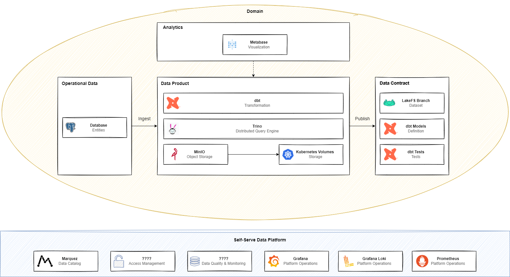
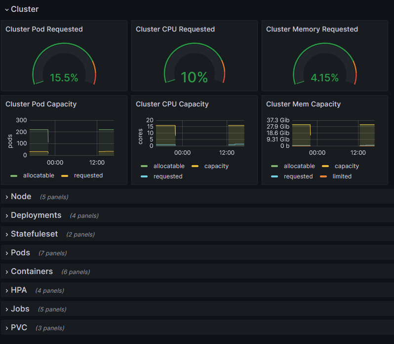
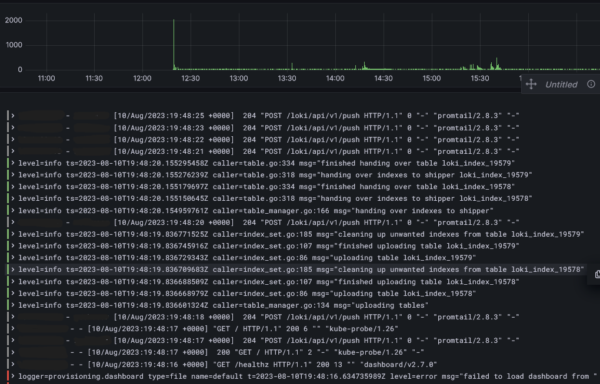

# Infrastructure

1. [Architecture](#architecture)
1. [Data Platform](#data-platform)
1. [Other Resources](#other-resources)
1. [Important Notes](#important-notes)

## Architecture

## Data Platform

Below is the description of all the resources deployed for the central self-serve data platform as defined
in the data mesh architecture. This is, that are managed by an data-platform team and not by the domains.

### Monitoring Stack (Grafana, Loki and Prometheus)

To achieve a better observability all the resources of the platform are monitored via
Prometheus + Loki + Grafana Stack. The role of **Prometheus** is to centralize all the metrics generated for each
tool (and also cluster resources) if the metrics are available. The same idea is implemented by
**Grafana Loki** but instead of metrics it collects logs, this is useful for a more complete overview of
the state of the platform. Finally, all these metrics and logs can be visualized on **Grafana** for people
to be able to take action. Is also on Grafana that alerts are managed based on the received information.

  
  

## Other Resources

Below are the resources used in the lab that are not directly a part of the centralized data platform and
that are created to support this lab in some way.

### PostgreSQL (Operational Data)

PostgreSQL is used to simulate the operational database that stores the information coming from Yelp page
for each domain. See [operational](../operational/) folder for more information about how the data is
created into the database.

> **Note**  
> For simplicity (and resource management) only one instance of postgres will be deployed for all domains
> (with a separated database for each one to achieve isolation). On a real world example this architecture
> can change since each domain operates their own microservices.

<!-- TODO: Add example image of the databases -->
<!-- TODO: If another use, write here -->

### Product

## Important Notes

* This project is deployed on a local cluster, for simplicity, the exposed services/
applications are done via a NodePort instead of other approaches;
* Also for simplicity, some security measures such as SSL connections, network policies and other cluster
security measures were not used, if using this project as a base for a production environment it is strongly
recommended that these measures are followed.
