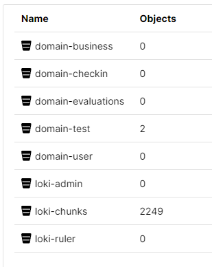
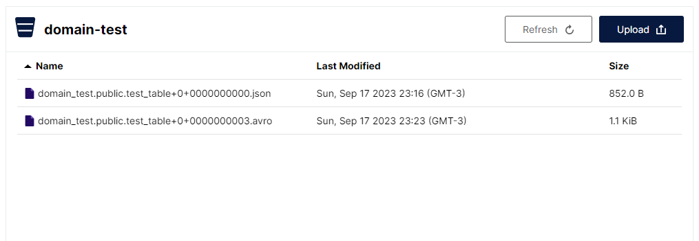

# Infrastructure

1. [Architecture](#architecture)
1. [Data Platform](#data-platform)
1. [FAQ](#faq)

## Architecture

<p align="center">

</p>

## Data Platform

Below is the description of all the resources deployed for the central self-serve data platform as defined
in the data mesh architecture. It is important to note that for optimization and simplicity **some resources
are used for multiple purposes. One example is PostgreSQL that is used by all the domains and also to
store the information required by Hive Metastore. Another is MinIO that besides analytical data stores
Loki information. On a real-world scenario this should be avoided.

### Monitoring Stack (Grafana, Loki and Prometheus)

To achieve a better observability all the resources of the platform are monitored via
Prometheus + Loki + Grafana Stack. The role of **Prometheus** is to centralize all the metrics generated for each
tool (and also cluster resources) if the metrics are available. The same idea is implemented by
**Grafana Loki** but instead of metrics it collects logs, this is useful for a more complete overview of
the state of the platform. Finally, all these metrics and logs can be visualized on **Grafana** for people
to be able to take action. Is also on Grafana that alerts are managed based on the received information.

<p float="left" align="center">
  
  
</p>

### Operational Data (PostgreSQL)

PostgreSQL is not really directly a part of the analytics data platform. In fact, it is used to simulate the
operational database for each domain. For simplicity (and resource optimization) we are going to use
only one instance of PostgreSQL for all the domains (with a database for each one).

> [!IMPORTANT]
> For more information about how the operational data is populated for each domain, go to
> [Notebook: Generate Operational Data](../scripts/generate-operational-data.ipynb).

<p float="left" align="center">
  
</p>

### Object Storage (MinIO)

To store all the data used in the project a **MinIO tenant** is deployed. This data will further be used with
**Trino** to make queries and **dbt** to transform and create products. Besides storing
operational/analytical data.

> [!NOTE]
> See [MinIO Tenant Values](storage/minio/values-tenant.yaml) on `tenant.bucket` configuration for more
> information about each bucket such as lifecycles, versioning and other configurations.

<p float="left" align="center">
  
  
</p>

#### Data Buckets and Medallion Architecture

Analytical data (including data coming from operational database) are all be stored using a
**[medallion (or multi-hop) architecture](https://www.databricks.com/glossary/medallion-architecture)**.
There are 3 layers of data used for each domain.

* **Bronze Layer:** Stores the raw data coming from different sources. For this lab, this means the
operational data ingested for analytics (and any other raw data) will be there.
* **Silver Layer:** Store data coming from the Bronze Layer after some cleaning,
merging, conforming and so on.
* **Gold Layer:** Stores data from the silver layer that are curated. For this lab, this means that the
data products will reside inside this bucket.

> [!NOTE]
> More details about formats, paths and so on, see
> [Data Ingestion](#data-ingestion-kafka-connect--debezium-postgresql-source--confluent-s3-sink);

### Data Ingestion (Kafka Connect + Debezium PostgreSQL Source + Confluent S3 Sink)

Since we are not using an event-driven architecture and we don't want the data platform to access the
operational data directly from the database, we use the process of Change Data Capture (CDC) to get all the
data from the operational database to our object storage to be further used by analytical purposes. This is
all done using **[Kafka Connect](https://docs.confluent.io/platform/current/connect/index.html)** and the chosen
[Debezium PostgreSQL Connector](https://debezium.io/documentation/reference/stable/connectors/postgresql.html)
and [Confluent Amazon S3 Sink Connector](https://docs.confluent.io/kafka-connectors/s3-sink/current/overview.html#).
The flow of data can be summarized as follows:

1. When an INSERT/UPDATE/DELETE operation occurs on PostgreSQL the data is sent to its respective Kafka Topic
(one for each table) by the PostgreSQL source connector. Other supported operations (i.e. TRUNCATE and
MESSAGE events will not be used in this lab);
2. When data arrive at the topics the S3 Sink Connector reads the information and send it to the
bronze area for each bucket (i.e. domain) on Avro Format partitioned by day.
<!-- TODO: Explain the next transformation -->

> [!NOTE]
> For more details about how the events are written in the topics by the Postgres Connector see
> [Debezium Postgres Connector: data change events](https://debezium.io/documentation/reference/stable/connectors/postgresql.html#postgresql-events)
> and
> [Debezium: New Record State Extraction](https://debezium.io/documentation/reference/stable/transformations/event-flattening.html).

In case a ad-hoc snapshot needs to be done. We also deployed Debezium with signaling tables feature. You can
understand more about this on
[How can I create a ad-hoc snapshot of a table?](processing/README.md#1-how-can-i-create-a-ad-hoc-snapshot-of-a-table)

<!-- TODO: Explain what can be done if data needs to be deleted GDPR -->
<!-- TODO: ### Distributed Query Engine (Trino + Hive Metastore) -->
## FAQ

### 1. How to access the services?

This project was created using a local machine running a Kubernetes Cluster. For simplicity all the relevant
services are exposed via NodePort (see table below for ports).

| **Application/Service**        | **Port**  |  **Notes**                  |
| ------------------------------ | --------- | --------------------------- |
| Prometheus                     | 30100     |                             |
| Grafana                        | 30110     |                             |
| Loki Gateway                   | 30120     |                             |
| PostgreSQL (Primary)           | 30200     |                             |
| MinIO Operator Console (http)  | 30210     |                             |
| MinIO Operator Console (https) | 30211     |                             |
| MinIO Tenant                   | 30212     |                             |
| Kafka Cluster                  | 30300     |                             |
| Trino*                         | 30310     | http://\<ADDRESS\>:30310/ui |
| Hive Metastore                 | 30320     |                             |
| MicroK8S Container Registry*   | 32000     | Assuming MicroK8S           |

### 2. What is the best deployment order?

Below is the recommended order to deploy/run the required applications/scripts to avoid conflicts or
missing dependencies between systems.

1. [Prometheus](monitoring/README.md#prometheus)
1. [MinIO](storage/README.md#minio-operator-and-tenant)
1. [Grafana Loki](monitoring/README.md#grafana-loki)
1. [Promtail](monitoring/README.md#promtail)
1. [Grafana](monitoring/README.md#grafana-loki)
1. [PostgreSQL](storage/README.md#postgresql)
1. [Run: Setup Operational Database](../infra/README.md#4-how-to-setup-operational-database)
1. [Kafka (and Kafka Connect)](processing/README.md#kafka-and-kafka-connect)
1. [Hive Metastore](processing/README.md#hive-metastore)

### 3. Can I use this infrastructure for a production environment?

Because this is not intended for a production environment, some things were simplified such as security
measures (e.g. SSL, Network Policies and other cluster security measures), access control (e.g. Ingress).
For this kind of use it is important that some best practices and recommended measures are followed.

### 4. How to setup operational databases?

Before starting to insert operational data into the PostgreSQL you should setup databases, users and tables.
You can do this by running the following scripts replacing the values between <>.

```shell
# Business Domain
pyenv exec poetry run python scripts/postgresql-run-script.py scripts/sql/business-domain-database-users.sql -s adminpass=<PASSWORD> -s debeziumpass=<PASSWORD> && pyenv exec poetry run python scripts/postgresql-run-script.py scripts/sql/business-domain-tables.sql -d domain_business

# Check-in Domain
pyenv exec poetry run python scripts/postgresql-run-script.py scripts/sql/checkin-domain-database-users.sql -s adminpass=<PASSWORD> -s debeziumpass=<PASSWORD> && pyenv exec poetry run python scripts/postgresql-run-script.py scripts/sql/checkin-domain-tables.sql -d domain_checkin

# Evaluations Domain
pyenv exec poetry run python scripts/postgresql-run-script.py scripts/sql/evaluations-domain-database-users.sql -s adminpass=<PASSWORD> -s debeziumpass=<PASSWORD> && pyenv exec poetry run python scripts/postgresql-run-script.py scripts/sql/evaluations-domain-tables.sql -d domain_evaluations

# User Domain
pyenv exec poetry run python scripts/postgresql-run-script.py scripts/sql/user-domain-database-users.sql -s adminpass=<PASSWORD> -s debeziumpass=<PASSWORD> && pyenv exec poetry run python scripts/postgresql-run-script.py scripts/sql/user-domain-tables.sql -d domain_user
```
